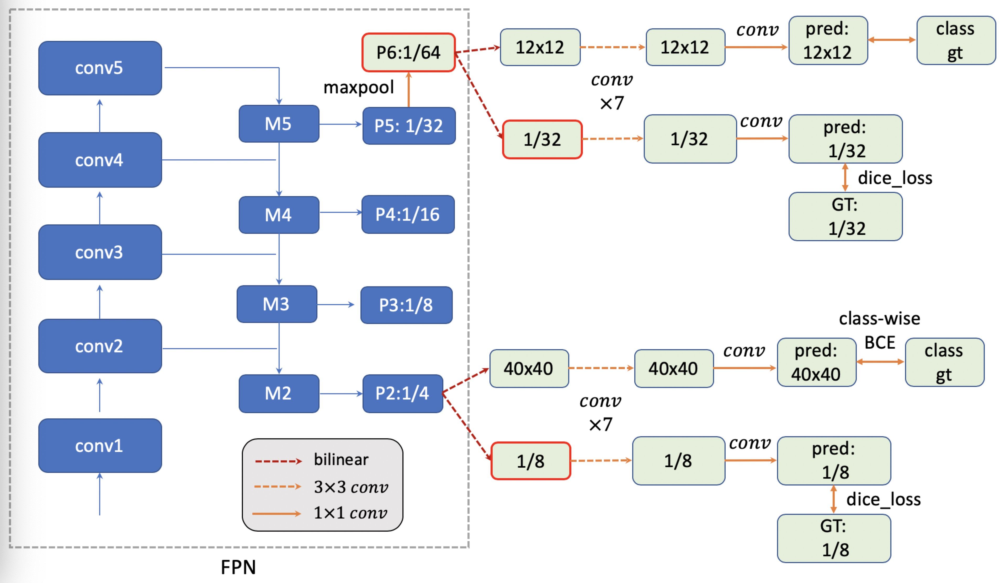

# SOLO unofficial
The code is an unofficial pytorch implementation of [SOLO: Segmenting Objects by Locations](https://arxiv.org/abs/1912.04488)


## Install
The code is based on [mmdetection](https://github.com/open-mmlab/mmdetection). Please check [Install.md](https://github.com/open-mmlab/mmdetection/blob/master/docs/INSTALL.md) for installation instructions.

## Training 
### Basic
Follows the same way as mmdetection.
single GPU: (for pdb debug)

```python tools/train.py configs/solo/r50_p2_p6_match_ml.py --work_dir r50_p2_p6_match_ml```

multi GPU (for example 8): 

```./tools/dist_train.sh configs/solo/r50_p2_p6_match_mlaug.py 8 --work_dir r50_p2_p6_match_ml_3X```

## Notes
The code only implements the simplest version of SOLO:
* 1x: `r50_p2_p6_match_ml.py`
* 3x: `r50_p2_p6_match_ml_aug.py`
* using vanilla SOLO instead of Decoupled SOLO
* implemented the simplest mask-nms: 
* **still in progress**

## Training log example (1x)
```
2020-02-14 02:34:20,390 - INFO - Epoch [1][50/7330]	lr: 0.00399, eta: 1 day, 2:32:21, time: 1.087, data_time: 0.111, memory: 7960, loss_cls: 0.9476, loss_mask: 1.7644, loss: 2.7120
2020-02-14 02:35:06,882 - INFO - Epoch [1][100/7330]	lr: 0.00465, eta: 1 day, 0:36:30, time: 0.930, data_time: 0.052, memory: 7960, loss_cls: 0.8290, loss_mask: 1.7436, loss: 2.5727
2020-02-14 02:35:54,244 - INFO - Epoch [1][150/7330]	lr: 0.00532, eta: 1 day, 0:05:55, time: 0.947, data_time: 0.055, memory: 7960, loss_cls: 0.7803, loss_mask: 1.6476, loss: 2.4279
2020-02-14 02:36:45,649 - INFO - Epoch [1][200/7330]	lr: 0.00599, eta: 1 day, 0:19:42, time: 1.028, data_time: 0.084, memory: 7960, loss_cls: 0.7539, loss_mask: 1.6324, loss: 2.3864
2020-02-14 02:37:32,214 - INFO - Epoch [1][250/7330]	lr: 0.00665, eta: 23:59:22, time: 0.931, data_time: 0.054, memory: 7960, loss_cls: 0.7308, loss_mask: 1.6618, loss: 2.3925
2020-02-14 02:38:19,773 - INFO - Epoch [1][300/7330]	lr: 0.00732, eta: 23:50:27, time: 0.951, data_time: 0.070, memory: 7960, loss_cls: 0.7185, loss_mask: 1.6393, loss: 2.3578
2020-02-14 02:39:08,042 - INFO - Epoch [1][350/7330]	lr: 0.00799, eta: 23:46:46, time: 0.965, data_time: 0.070, memory: 7960, loss_cls: 0.7407, loss_mask: 1.6516, loss: 2.3923
2020-02-14 02:39:55,616 - INFO - Epoch [1][400/7330]	lr: 0.00865, eta: 23:41:16, time: 0.951, data_time: 0.059, memory: 7960, loss_cls: 0.6650, loss_mask: 1.7049, loss: 2.3700
2020-02-14 02:40:43,378 - INFO - Epoch [1][450/7330]	lr: 0.00932, eta: 23:37:24, time: 0.955, data_time: 0.063, memory: 7960, loss_cls: 0.6887, loss_mask: 1.5228, loss: 2.2115
2020-02-14 02:41:28,909 - INFO - Epoch [1][500/7330]	lr: 0.00999, eta: 23:27:39, time: 0.911, data_time: 0.044, memory: 7960, loss_cls: 0.6639, loss_mask: 1.5959, loss: 2.2598
2020-02-14 02:42:17,590 - INFO - Epoch [1][550/7330]	lr: 0.01000, eta: 23:27:55, time: 0.974, data_time: 0.048, memory: 7960, loss_cls: 0.6725, loss_mask: 1.5047, loss: 2.1771
2020-02-14 02:43:05,815 - INFO - Epoch [1][600/7330]	lr: 0.01000, eta: 23:26:52, time: 0.965, data_time: 0.047, memory: 7960, loss_cls: 0.6454, loss_mask: 1.5493, loss: 2.1947
2020-02-14 02:43:54,693 - INFO - Epoch [1][650/7330]	lr: 0.01000, eta: 23:27:19, time: 0.977, data_time: 0.064, memory: 7960, loss_cls: 0.6249, loss_mask: 1.5785, loss: 2.2034
2020-02-14 02:44:45,068 - INFO - Epoch [1][700/7330]	lr: 0.01000, eta: 23:30:44, time: 1.008, data_time: 0.077, memory: 7960, loss_cls: 0.6156, loss_mask: 1.5290, loss: 2.1446
2020-02-14 02:45:34,278 - INFO - Epoch [1][750/7330]	lr: 0.01000, eta: 23:31:18, time: 0.984, data_time: 0.050, memory: 7960, loss_cls: 0.6018, loss_mask: 1.3914, loss: 1.9932
2020-02-14 02:46:23,707 - INFO - Epoch [1][800/7330]	lr: 0.01000, eta: 23:32:05, time: 0.989, data_time: 0.084, memory: 7960, loss_cls: 0.5828, loss_mask: 1.4481, loss: 2.0308
```
## Dev Logs
### Network logic (need to check)

### Details (need to check)
 - [ ] Classification:
`flatten_cls_scores`: flattened w.r.t. all images and all levels

`loss_cls = self.loss_cls(flatten_cls_scores, category_targets, avg_factor=num_pos + num_imgs)`
 - [x] Mask: per-instance dict_loss, ave over all instances in a batch
 
 `loss_mask[j,i] = self.dict_loss_batch(pred_mask, ins_mask)`

`loss_mask = self.dict_weight * torch.mean(loss_mask)`
<!--stackedit_data:
eyJoaXN0b3J5IjpbLTcxMTIzMTg0NiwxNzI3NTQ5OTU2LDE1Nz
AwNjMxODldfQ==
-->